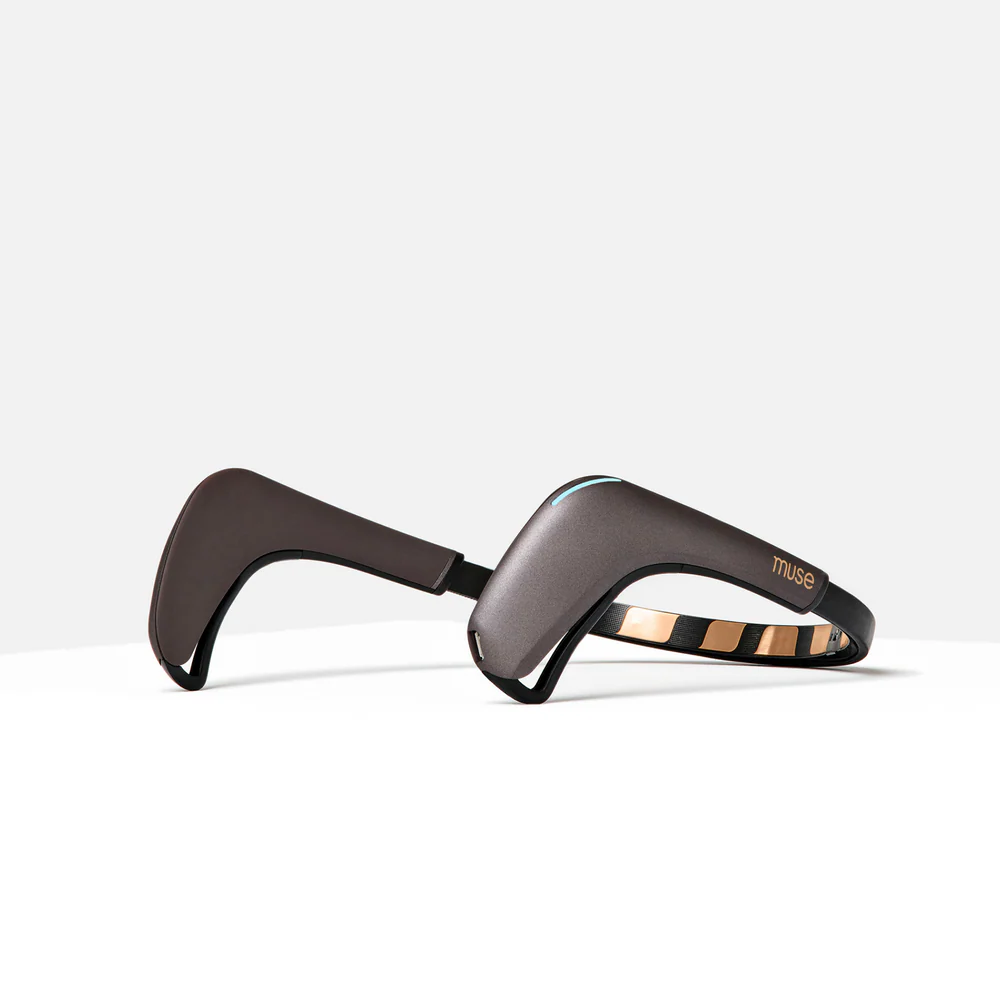
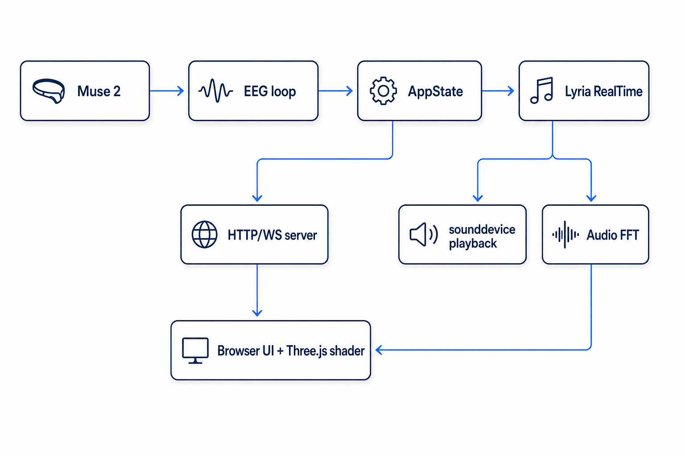

<!-- _class: title -->
<!-- _paginate: false -->

# brain-music

## Live EEG-Driven Music & Visuals from a $200 Headset

Ashrit Verma  ·  May 14, 2026

AI disclosure: this slide deck (layout, prose, diagrams) was drafted with the assistance of an AI coding agent (Anthropic Claude). The underlying project, code, and engineering decisions are the author's own; AI was used as a writing and design tool for these slides.

---

## The one-liner

A single Python process reads EEG from a **Muse 2** over Bluetooth, generates **continuous music** with **Google Lyria RealTime**, and renders **continuous visuals** in a Three.js shader — all modulated in real time by what your brain is doing.

**One prompt drives both the music and the visuals.**

---

## The hardware: Muse 2

**Interaxon Muse 2** — a ~$200 consumer wellness headband.

Key features:

- **4 dry electrodes** — TP9, AF7, AF8, TP10
- **256 Hz** sample rate per channel
- **Bluetooth Low Energy** — no cables, all-day wearable
- **No gel, no skin prep** — put it on and go
- **Onboard accelerometer + gyroscope** (unused here)
- **Lithium battery** — ~5 hr session life

---

<!-- _class: full-image -->
<!-- _paginate: false -->

---

## Mapping: EEG → Lyria

| EEG feature | Lyria knob | Range | Intuition |
| --- | --- | --- | --- |
| **α** (alpha) | brightness | 0 – 1 | eyes-closed relaxation → brighter timbre (treble lift) |
| **β** (beta) | density | 0 – 1 | active focus → denser arrangement, more concurrent layers |
| **θ** (theta) | temperature | 0.5 – 1.9 | drowsy / meditative → wilder excursions inside the prompt |
| **asymmetry** | bpm | 55 – 160 | right-frontal lean → faster; left-frontal lean → slower |

**Asymmetry** = frontal alpha asymmetry: `tanh(log α_AF8 − log α_AF7)`. Balance of alpha power between the left and right frontal lobes. Idles ≈ 0.5; positive values mean less left-frontal alpha (approach motivation).

Global <code>SENSITIVITY_GAIN = 2.0</code> — amplifies deviation from the neutral 0.5 midpoint *before* lerping into Lyria's range, so mid-range brain shifts reach the audibly-extreme zone instead of dying in tanh's middle.

---

## The visualizer

Same `AppState` features drive Three.js shader uniforms. Every **15–30 s** the shader cross-fades between four regimes — brain modulates intensity *inside* whichever regime is active.

### calm

subtle drift, image stays mostly stable

### tunnel

log-spiral zoom into infinity

### kaleidoscope

angular fold into 6–12 mirror segments

### ripple

concentric water-waves from center

**Seed evolver** — every ~24 s, a Claude-templated drift descriptor rewrites the prompt and Imagen regenerates the seed texture. The image at minute 5 is downstream of where your brain has been drifting since minute 0.

---

## Latency sources

| Stage | Latency | Driven by |
| --- | --- | --- |
| Muse 2 BLE + BrainFlow buffering | ~30 ms | Packet-level BLE |
| Welch PSD window | ~250–500 ms | `WINDOW_SIZE=256` ≈ 1 s; median lag for change to register |
| EMA smoothing | ~150–300 ms | `SMOOTHING_ALPHA=0.30` (~3-tick time constant @ 4 Hz) |
| Perform tick → Lyria push | 0–250 ms | `PERFORM_TICK_S=0.25` |
| **Lyria chunk boundary wait** | **0–2000 ms (mean ~1 s)** | **Dominant term — config applies on the *next* chunk** |
| Lyria network RTT | ~50–150 ms | One WS round-trip per push |
| Audio output buffer | ~20–40 ms | CoreAudio (+ BlackHole if routing to Logic) |
| **End-to-end (brain → audible change)** | **~1.6 – 2.8 s** | Floor when push lands at chunk boundary; ceiling when right after one |

---

## Problems encountered

- **Calibration drift across the day.** Same headset, same fit, different time of day → the 8 s baseline μ/σ diverges noticeably. Without re-calibrating, α and β saturate one side and the music pegs. Today: manual `r` / browser **Recalibrate** button. *Want: rolling percentile baseline, auto-managed.*
- **Lyria content filter** silently kills prompts naming an artist/style/album → built a **Claude prompt-guard** that rewrites filtered prompts into pure sonic descriptors (drums, instrumentation, era, vibe).
- **Muse 2 + macOS CoreBluetooth** leaves stale handles after teardown → mandatory 0.3 s + 2 s sleeps in `Board.stop()`, plus `muse2 bt-reset` operator command for nuclear cases.
- **Reconnect supervisors** for both BLE *and* Lyria WS — 3-attempt linear backoff, both can drop at any time.
- **Lyria 2-second chunk boundary** is the floor on responsiveness (see latency slide).

---

## The recalibration problem, in detail

**Symptom:** start a session in the morning, alpha bar sits at 0.30, music is restrained. Start a second session at 11 PM with the same prompt, alpha sits at 0.85 — music is over-bright and pegging temperature.

**Cause:** the 8 s baseline only sees that moment's μ/σ. Time-of-day, hydration, recent screen exposure, headset fit micro-shifts all change the noise floor and the log-band-power distribution.

**Today:** press `r` (or browser **Recalibrate**) — but the user has to *know* it drifted.

**Proposed fix:** rolling adaptive baseline.

- Reuse the `_AdaptiveBaseline` pattern from `audio/fft.py` (attack 0.30 / release 0.005).
- Track μ over a 60–120 s window continuously.
- Optional UI: show a small drift meter so the operator can see when re-baselining is warranted.

---

## Future improvements

| Stage | Today | Proposed |
| --- | --- | --- |
| Welch window | 1 s @ 256 Hz | **Overlap-and-add** at 50% hop → ~500 ms lag. Or **AR PSD** (Burg) on a sliding 0.5 s window → sub-100 ms. |
| EMA smoothing | α=0.30 fixed | **Adaptive α**: large on direction changes (Kalman-style), small in steady state. ~½ the lag on transitions. |
| Lyria chunk boundary | 0–2 s | **Speculative push**: tiny AR(2) on the EEG feature, push *predicted* config one tick early. |
| Sensitivity | global `GAIN=2.0` | **Per-user auto-tune** from the calibration tail's σ. |
| Mapping curves | single linear lerp | **Per-axis curves** (logistic for density, gamma for brightness). |
| Audio features | mono FFT | **Stereo L/R centroid difference** → panning-aware visuals. |

Combined latency floor: **~0.8 s → ~0.3–0.5 s** — brain → audible change inside one breath.

---

## Future features & how I'd build them

- **Multi-modal fusion** — Whoop HRV, breathing belt, eye-tracker all feed the same `AppState` as new features. *Build:* one adapter module per device; mapping + visualizer untouched.
- **Personalized mapping profiles** — auto-learn the axis a given user controls best and amplify it. *Build:* offline analysis on session logs → per-user `mapping.json` overlay.
- **Calibration-free onboarding** — replace the 8 s capture with auto-fire on SNR + fit stability. *Build:* SNR gate + the rolling baseline from slide 9.
- **Session memory** — save the evolved prompt trail + EEG trace per session; replay later. *Build:* append-only JSON log + a `muse2 replay <session-id>` CLI.
- **Multi-user "duet" mode** — two headsets, one Lyria session, params are an L2-weighted blend. *Build:* `AppStateGroup` aggregator + UI to weight contributors.

---

## Beyond music — channeling the same chain into smart home

The course's purview is music; however, I was inpsired!

Building this project directly inspired the next one: **wearable telemetry → smart home environment.**

- Same Muse 2 features + **Whoop HRV** + sleep-stage telemetry + ambient sensors → modulate the room itself.
- **Lights** warm + dim when β drops below baseline for >2 min (winding down).
- **HVAC** nudges 1 °F warmer when θ rises late evening.
- **Speakers** cross-fade to ambient when blink rate doubles (eye fatigue).
- Output side is **MQTT + Home Assistant** — much easier to wire than Lyria.

The headband becomes a **context broker for the room**, not just a music controller. Same `AppState` abstraction, different consumers downstream.

---

## What I learned

- **Real-time generative audio + a 2 s chunk model are fundamentally in tension.** Mapping design matters more than push rate.
- The right level for a "brain feature" is **not** raw band power — it's `log → EMA → baseline-normalize → soft-clip`. Operator-controlled floor and ceiling.
- **Consumer EEG is good enough for expressive coupling.** The limit is mapping design + the generative model's response time, not the electrodes.
- A single shared `AppState` + asyncio races beats a multi-process IPC architecture for this scale — easier to reason about, easier to debug, easier to ship to Railway.
- The hardest bug was never the math. It was always **macOS Bluetooth state hygiene.**

---

<!-- _class: title -->
<!-- _paginate: false -->

# Thanks

## Questions?

Ashrit Verma  ·  `github.com/AshritVerma/brain-music`

---

<!-- _class: divider -->
<!-- _paginate: false -->

# Appendix

---

## Why this mapping (and not some other one)

Three explicit design choices, each load-bearing:

- **α → brightness, β → density.** Both move continuously and Lyria responds within ~2 s — the right cadence for slow EEG modulation. Discrete knobs (key, scale) wouldn't track band-power drift; continuous ones do.
- **θ → temperature** gives the *"trance state pushes the model out of the safe basin"* feel the audience expects from a brain-driven music box. Theta is the lowest-frequency band; coupling it to model entropy is metaphorically correct *and* sounds right.
- **asymmetry → bpm** (not a band power) because asymmetry is the **only feature centered at 0.5 with symmetric variance**. Band powers after tanh are bottom-heavy → bpm would drift to one end. Asymmetry idles bpm at the middle of [55, 160], which is musically neutral.
- **`SENSITIVITY_GAIN = 2.0`** because tanh of a z=±2 deviation squashes to ~0.96. A 1:1 mapping wastes Lyria's envelope; gain=2.0 pulls mid-range brain shifts into the audibly-extreme zone.

---

## Server / API traffic per minute

Steady-state, one user, default config:

| Call | Rate | Notes |
| --- | --- | --- |
| **`set_music_generation_config` → Lyria** | **240 /min** | 4 Hz, one per `eeg_tick` |
| **Lyria → us (audio chunks)** | ~30 /min | One ~2 s stereo chunk every ~2 s |
| **WS snapshot → each browser** | **1,200 /min/client** | `SERVER_BROADCAST_HZ = 20` |
| **Imagen seed evolver** | ~2.5 /min | 1 per 12 chunks, ~150/hr |
| **Claude prompt-polish** | ~2.5 /min | Paired with each evolver cycle |
| **Claude prompt-guard rewrite** | ≤ 1 /session | Only if Lyria filters the initial prompt |

**Cost reality check:** ~$3/hr on Imagen alone at default cadence. Lyria session billed per second of WS connection. Set `--evolve-chunks 0` to skip the evolver entirely.

---

## EEG feature pipeline

Per 1 s window (256 samples @ 256 Hz), 4 Hz output rate:

1. **Welch PSD** per frontal channel (AF7, AF8) — Hanning window, 50% overlap.
2. **Band powers** — θ (4–8 Hz), α (8–12 Hz), β (13–30 Hz).
3. **Log-compress** — band powers are roughly log-distributed; `log10(x + 1e-6)`.
4. **EMA smooth** — `α=0.30` (~3-tick / ~750 ms time constant).
5. **8 s baseline calibration** at session start → per-feature μ, σ.
6. **tanh z-score normalize** — `0.5 * (tanh((x - μ)/σ) + 1)` → soft-clipped `[0, 1]`.
7. **Frontal alpha asymmetry** — `tanh(log α_AF8 − log α_AF7)` → idle ≈ 0.5.
8. **Discrete triggers** — blink (peak-to-peak on AF7/AF8 > 1000 μV), jaw (HP burst > 220 μV).

> Output: four normalized `[0, 1]` features + two triggers, refreshed at 4 Hz, written to `AppState`.
